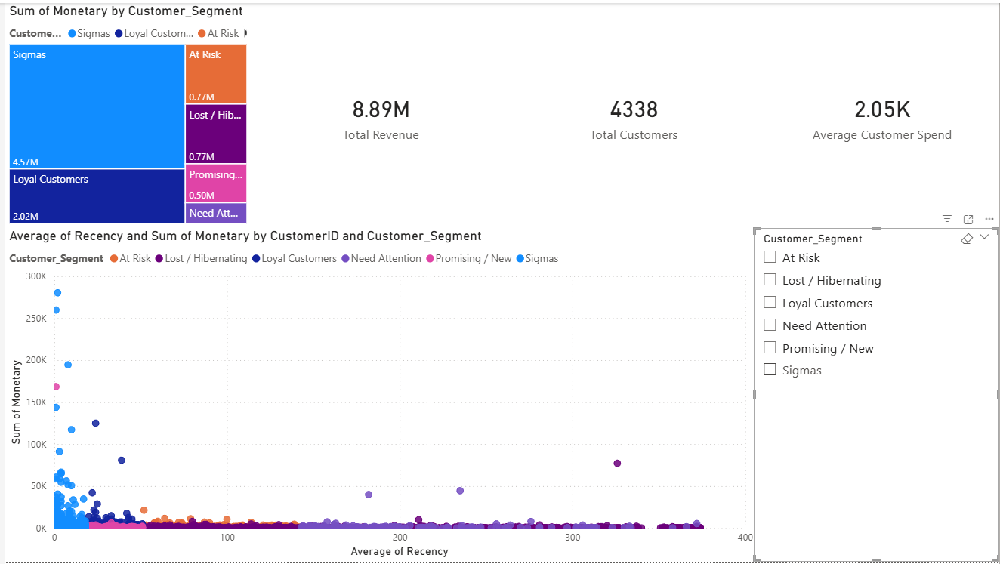
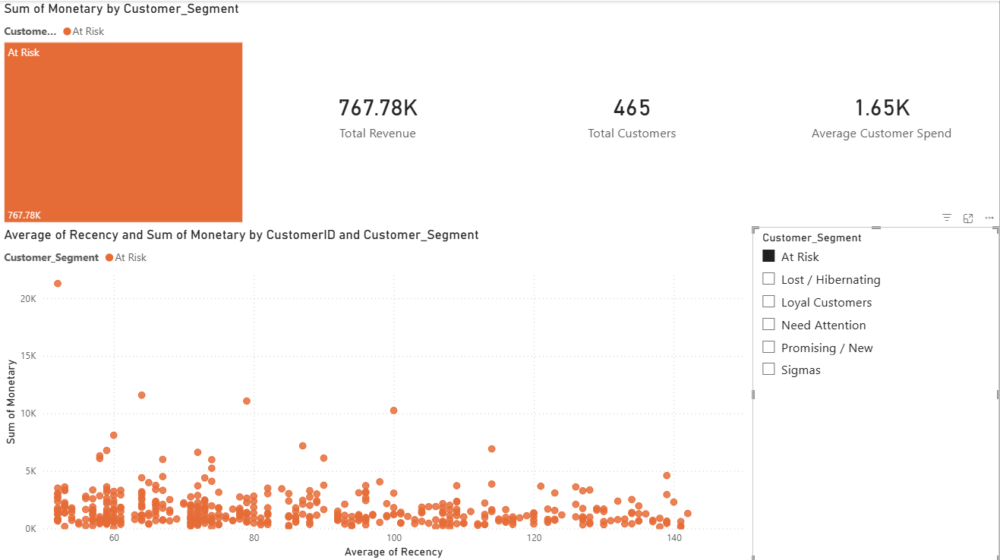

# ecommerce-churn-analysis
E-commerce Customer Churn & Sales Analysis

# E-commerce Churn Analysis & RFM Customer Segmentation

## Описание проекта
Бизнес-кейс по анализу клиентской базы интернет-магазина, выявлению сегментов аудитории и рисков оттока клиентов. 
На основе транзакционных данных проведена очистка, построен RFM-анализ, сделан финансовый аудит и собран интерактивный дашборд для CRM-маркетинга.

--- 

## Технологический стек
* **Python (Pandas, NumPy):** Очистка данных, обработка аномалий, расчет метрик Recency, Frequency, Monetary.
* **SQL (PostgreSQL, SQLAlchemy):** Хранение и агрегация обработанных данных.
* **Power Bi:** Построение интерактивной панели мониторинга KPI и сегментов. 
* **Data Visualization (Seaborn / Matplotlib):** Exploratory Data Analysis (EDA).

---

## Ключевые результаты и финансовы инсайты

| Сегмент | Кол-во клиентов | Доля клиентов (%) | Выручка (£) | Доля выручки (%) | Средний чек (£) |
| :---: | :---: | :---: | :---: | :---: | :---: |
| **Sigmas (VIP)** | 609 | 14.0% | £4,568,618 | **51.4%** | £7,501 |
| **Loyal Customers** | 914 | 21.1% | £2,015,511 | **22.7%** | £2,205 |
| **At Risk** | 465 | 10.7% | £767,776 | **8.6%** | £1,651 |
| **Lost / Hibernating**| 1,504 | 34.7% | £765,260 | **8.6%** | £508 |
| **Promising / New** | 665 | 15.3% | £499,604 | 5.6% | £751 |
| **Need Attention** | 181 | 4.2% | £270,437 | 3.0% | £1,494 |

### Главные выводы: 
1. **Подтверждение правила Парето:** 14% клиентов ('Sigmas') генерируют более *51%* всей выручки магазина
2. **Критический фокус оттока:** Сегмент 'At Risk' составляет всего 10.7% базы, но генерирует столько же денег, сколько вся огромная группа ушедших клиентов ('Lost' - 34.7%). Потеря одного клиента 'At Risk' стоит в 3 раза дороже, чем клиента из 'Lost'.

---

## Интерактивный дашборд POWER BI



### Детализация зоны риска (At Risk Segment):

Dc
---

## 🎯 Бизнес-рекомендации (CRM-стратегия)

* **Sigmas (VIP):** Персональный менеджер, закрытые предпродажи, отсутствие спам-скидок (фокус на сервисе).
* **At Risk:** Срочные реактивационные триггерные рассылки с персонализированным промокодом (срок 7 дней) и опрос о причинах снижения активности.
* **Lost / Hibernating:** Отключение от платных рекламных каналов (таргет), только редкие автоматические e-mail рассылки во время крупных распродаж.
* **Promising / New:** Настройка Welcome-серии писем и скидка на повторную покупку в течение 14 дней для удержания.

---

## 📁 Структура репозитория
```text
├── data/
│   ├── raw/             # Исходные транзакционные данные
│   └── processed/       # Итоговый CSV с RFM-сегментами
├── notebooks/           # Jupyter Notebooks с EDA и RFM-моделью
├── images/         # Скриншоты дашборда и графиков
├── dashboards/          # Файл отчета Power BI (.pbix)
└── README.md            # Отчет по проекту

